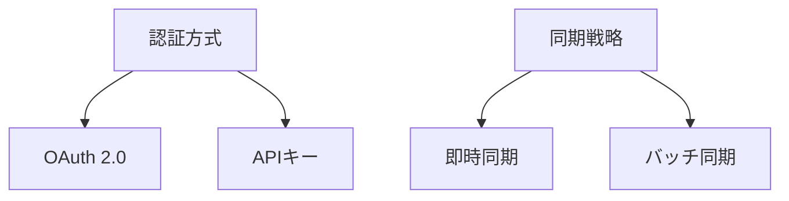

# 現在の開発コンテキスト

## 優先開発項目
1. **認証フロー実装**
   - Google OAuth 2.0統合
   - トークン管理システム
2. **コア同期ロジック**
   - タスク⇄イベント変換モジュール
   - 差分検出アルゴリズム
3. **UIコンポーネント**
   - 設定画面(obsidianのデフォルトUI)
   - 同期ステータス表示

## 保留中の決定事項

## 技術的課題
- Obsidianのサンドボックス制約下でのGoogle API連携
- モバイル環境での認証フロー最適化
- オフライン時の同期キュー管理
