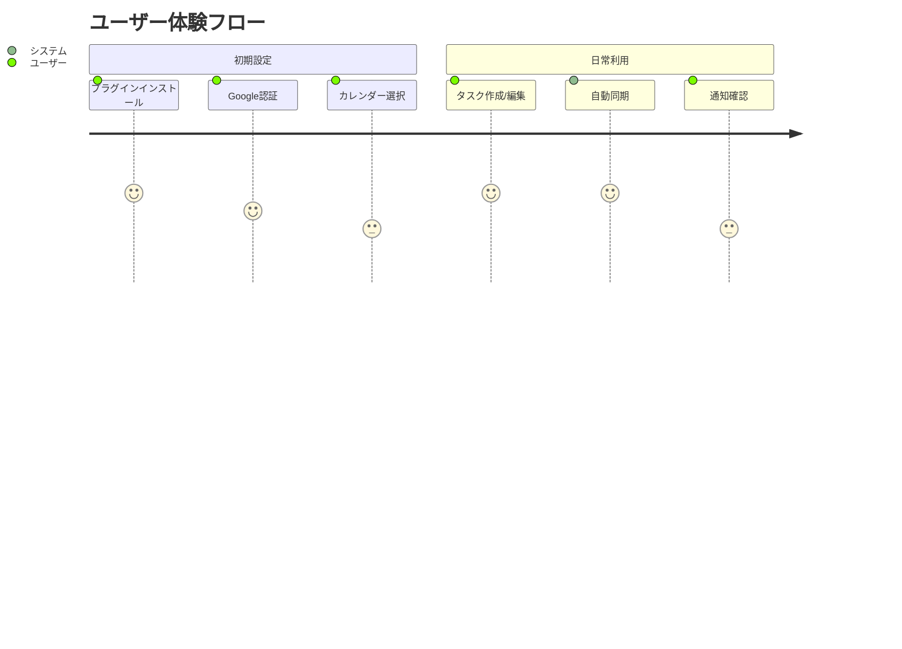

# プロダクトコンテキスト

## 背景と目的
ObsidianユーザーがGoogle Calendarとタスクを同期させることで、以下の課題を解決:
- タスク管理ツール間の情報分散
- 手動同期の手間
- リマインダー設定の重複作業

## ユーザー体験フロー

## 主要ユースケース
1. 自動同期モード
   - 設定間隔で自動的にタスク⇄イベントを同期
2. 手動同期モード
   - ユーザー要求時に同期を実行
3. コンフリクト解決
   - 変更衝突時の解決インターフェースを提供
