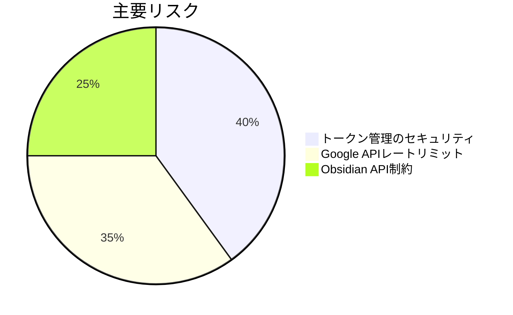

# プロジェクト進捗状況

## 完了済み項目
- [x] 基本設計書の作成
- [x] Memory Bankの初期セットアップ
- [x] 技術スタックの選定
- [x] Google OAuth 2.0統合 (認証フロー、コールバック処理、トークン保存)

## 進行中項目
- [ ] トークンリフレッシュ処理
- [ ] Google Tasks API連携
- [ ] 同期機能実装
- [ ] 設定画面UI (50%)

## 課題とリスク

## 次回マイルストーン
1. トークン自動更新機能の実装
2. Google Tasks APIとの連携
3. タスク同期機能の基本実装
