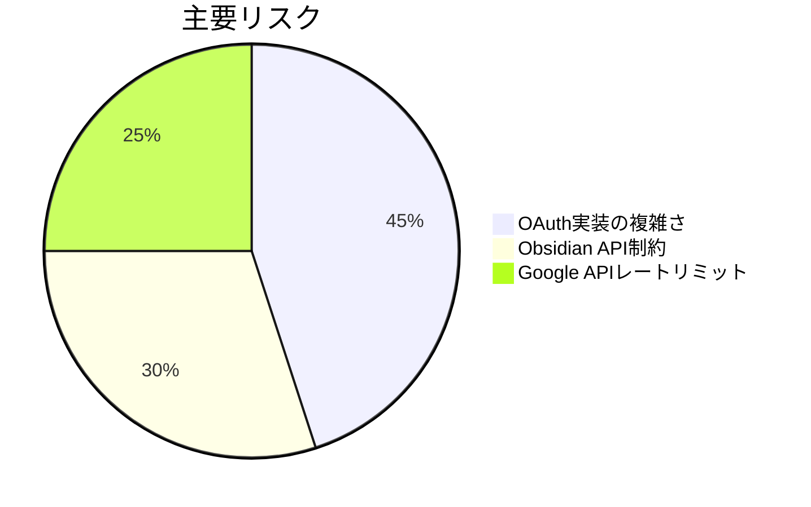

# プロジェクト進捗状況

## 完了済み項目
- [x] 基本設計書の作成
- [x] Memory Bankの初期セットアップ
- [x] 技術スタックの選定

## 進行中項目
- [ ] Google OAuth 2.0統合 (50%)
- [ ] タスク変換ロジック (30%)
- [ ] 設定画面UI (20%)

## 課題とリスク

## 次回マイルストーン
1. 認証モジュールのプロトタイプ完成
2. 基本同期フローの実装
3. 設定画面のワイヤーフレーム作成
