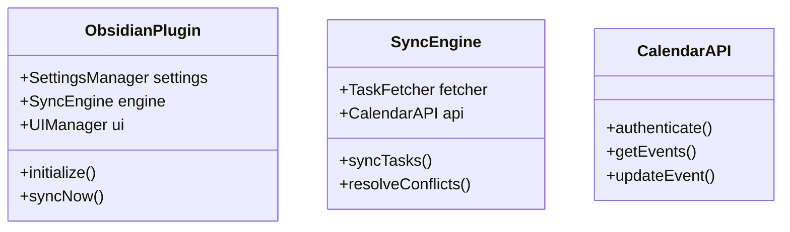
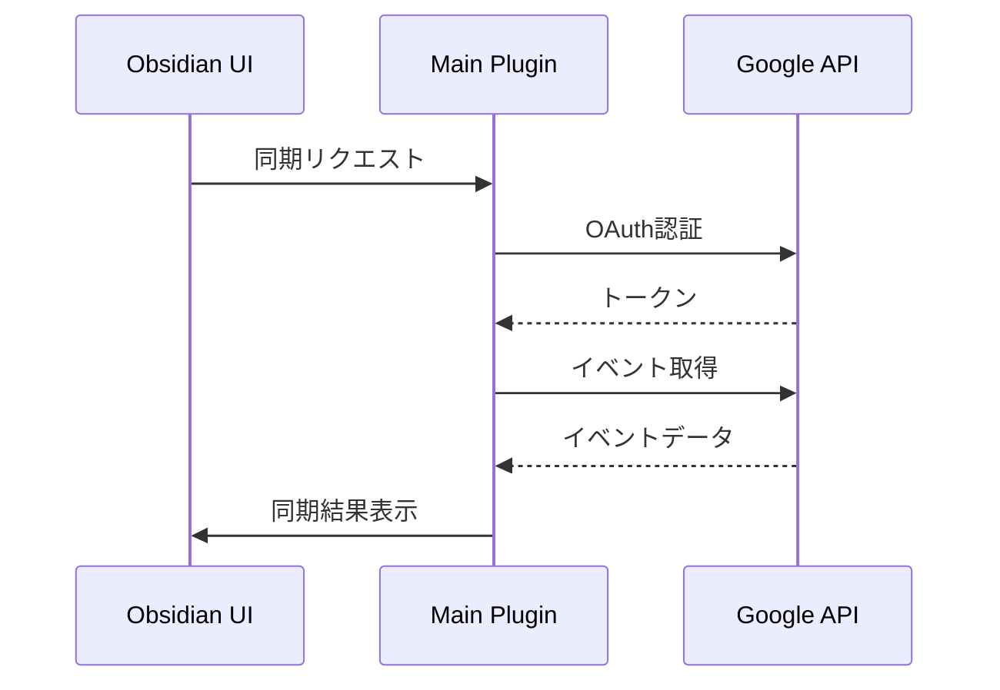

# システムアーキテクチャパターン

## 主要コンポーネント

```mermaid
classDiagram
    class ObsidianPlugin {
        +SettingsManager settings
        +SyncEngine engine
        +UIManager ui
        +initialize()
        +syncNow()
    }

    class SyncEngine {
        +TaskFetcher fetcher
        +CalendarAPI api
        +syncTasks()
        +resolveConflicts()
    }

    class CalendarAPI {
        +authenticate()
        +getEvents()
        +updateEvent()
    }
```

## データフロー

```mermaid
sequenceDiagram
    participant UI as Obsidian UI
    participant Plugin as Main Plugin
    participant API as Google API

    UI->>Plugin: 同期リクエスト
    Plugin->>API: OAuth認証
    API-->>Plugin: トークン
    Plugin->>API: イベント取得
    API-->>Plugin: イベントデータ
    Plugin->>UI: 同期結果表示
```

## 同期アルゴリズム
1. 差分検出:
   - 最終同期時刻後の変更を検出
   - 変更タイプ(追加/更新/削除)を識別
2. コンフリクト解決:
   - 最終更新時刻比較
   - ユーザー設定に基づく優先順位
