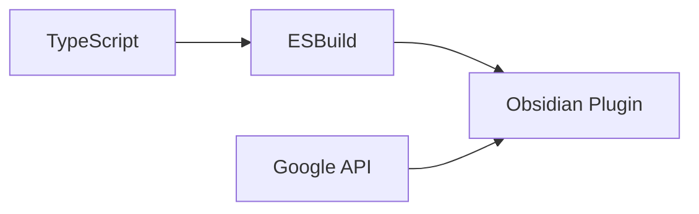

# 技術コンテキスト

## コア技術スタック
- **フロントエンド**:
  - Obsidian Plugin API (TypeScript)
- **バックエンド**:
  - Google Calendar API v3
  - OAuth 2.0認証

## 開発環境


## 主要依存関係
```json
{
  "dependencies": {
    "googleapis": "^108.0.0",
    "obsidian": "latest",
    "react": "^18.2.0"
  }
}
```

## アーキテクチャ制約
1. Obsidianのサンドボックス環境制限
2. Google APIのレートリミット
3. モバイル/デスクトップ両対応UI
