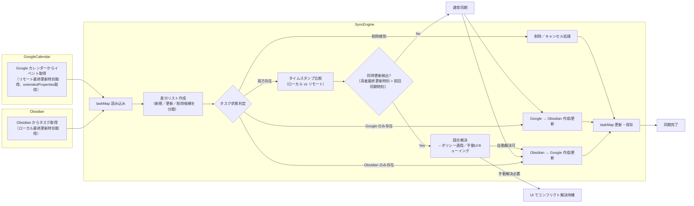

```mermaid

flowchart LR
    subgraph Obsidian
      O1["Obsidian からタスク取得<br>（ローカル最終更新時刻取得）"]
    end
    subgraph GoogleCalendar
      G1["Google カレンダーからイベント取得<br>（リモート最終更新時刻取得、extendedProperties取得）"]
    end
    subgraph SyncEngine
      S1[taskMap 読み込み]
      S2["差分リスト作成<br>（新規／更新／削除候補を分類）"]
      S3{タスク状態判定}
      S2b["タイムスタンプ比較<br>（ローカル vs リモート）"]
      C1{"同時更新検出?<br>（両者最終更新時刻 > 前回同期時刻）"}
      C2["競合解決<br>– ポリシー適用／手動UIキューイング"]
      S4[Obsidian → Google 作成/更新]
      S5[Google → Obsidian 作成/更新]
      S6[削除／キャンセル処理]
      S7[taskMap 更新・保存]
    end

    O1 --> S1
    G1 --> S1
    S1 --> S2
    S2 --> S3

    S3 -- Obsidian のみ存在 --> S4
    S3 -- Google のみ存在 --> S5
    S3 -- 両方存在 --> S2b

    S2b --> C1
    C1 -- Yes --> C2
    C1 -- No --> NoConflict[通常同期] --> S4
    NoConflict --> S5

    C2 -- 自動解決可 --> S4
    C2 -- 手動解決必要 --> Manual[UI でコンフリクト解決待機]

    S3 -- 削除検知 --> S6

    S4 --> S7
    S5 --> S7
    S6 --> S7

    S7 --> End[同期完了]

```
