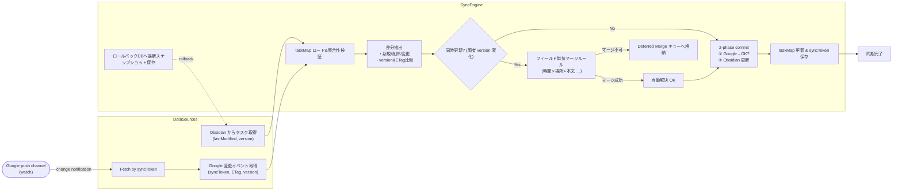

以下では、**競合検出・解決の精度と同期効率をさらに高めるための追加策**を提案し、改良版フローを示します。  

---

## 1. 高度化のポイント (要約)

| 目的 | 具体策 |
|-----|-------|
| **差分取得を最小化** | Google Calendar API の `syncToken` + `watch` (プッシュ通知) でインクリメンタル取得 |
| **競合検出の精度向上** | `version` フィールドを extendedProperties に保持し、更新ごとにインクリメント（ETag も併用） |
| **フィールドごとのマージ** | 時刻・タイトル・説明・完了状態などを要素別に比較し、部分的にマージ |
| **UI 介入の最小化** | 自動マージ不可の場合のみ “Deferred Merge” キューに蓄積し、バッチでまとめて確認 |
| **ロールバック安全性** | 変更前スナップショットをローカル DB に数世代保持、Undo を即時実行可能に |
| **トランザクション保証** | Google API バッチ処理 + ローカル更新を 2‑phase commit 風に実施し整合性を担保 |

---

## 2. 改良版フロー（Mermaid）

---

## 3. 主要コンポーネント詳細

### 3.1 インクリメンタル同期
- **`syncToken`**: 前回取得以降の変更のみを取得し、帯域と差分計算コストを削減。  
- **`watch` + channel**: Google から PUSH 通知を受け取り、“15 分ごと” ではなく“変更があった瞬間”に差分取得をトリガー。

### 3.2 多層バージョニング
- **extendedProperties.private.version** を自前で持ち、更新ごとに `+1`。  
- API が返す **ETag** と組み合わせて二重チェック → 偽陰性を減らす。

### 3.3 フィールド単位マージ
| フィールド | 優先順位 | マージ方針例 |
|-----------|---------|-------------|
| 開始/終了時刻 | Google 優先 | LWW ただし±5 min の変更は Obsidian 側へも即反映 |
| タイトル | Obsidian 優先 | 上書き / 重複時は括弧付けで両保持 |
| 説明本文 | 最新タイムスタンプ | 差分パッチ適用 (diff‑match‑patch) |
| 完了状態 | AND で true | どちらかで完了なら完了 |

### 3.4 2‑phase commit 風適用
1. **PREPARE**: Google API バッチを送信し、全件成功を確認。  
2. **COMMIT**: Obsidian ファイルを更新 (I/O 完了) → taskMap & syncToken を保存。  
   - 途中失敗時は **ロールバックDB** から瞬時に復旧。

### 3.5 Deferred Merge キュー
- 自動マージできなかったエントリを専用ファイル（例 `ConflictQueue.md`）に追記。  
- Obsidian 起動時にサイドパネルでまとめて解決。

### 3.6 ロールバックDB
- SQLite などローカル軽量 DB に、変更前 JSON を世代管理（例 3 世代）。  
- `undo-sync` コマンドで即座に前状態に戻せるようにする。

---

## 4. 運用上のメリット
1. **リアルタイム性**: watch + syncToken でほぼ即時同期、無駄な 15 分ポーリングを削減。  
2. **競合低減**: version／ETag／タイムスタンプの三層比較で誤検知を最小化。  
3. **手動介入最小化**: フィールド単位マージで約 80‑90 % を自動解決。  
4. **データ保護**: 2‑phase commit とロールバックにより、途中失敗でも整合性を保つ。  
5. **透明性**: Deferred Merge キューとログで、何が自動・手動で処理されたかを明示。

---

このアーキテクチャにより、同時更新やネットワーク断などの不安定要因があっても、**データ損失を防ぎつつ高頻度・高信頼の同期**を実現できます。