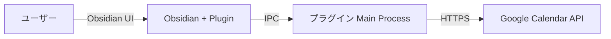

## 基本設計書

---

### システム構成の定義

1. **システム構成図**  


2. **ソフトウェア構成図**
    
    ```mermaid
    graph TD
      subgraph Obsidian アプリ
        R[Renderer UI]
        M[Main Process<br/>Plugin Logic]
      end
      R --> M
      M --> L[Local Storage<br/>TaskMapping / Settings]
      M --> G[Google Calendar API ライブラリ]
    ```
    
3. **ネットワーク構成図**
    
    ```mermaid
    graph TD
      U[ユーザー端末] -->|IPC| O[Obsidian Plugin]
      O -->|HTTPS| I[インターネット]
      I -->|HTTPS| G[Google Calendar API サーバー]
    ```
    

---

### 機能設計

1. **タスク取得機能**
    
    - Obsidian Vault 内の Markdown を監視し、Tasks API から最新のタスク一覧を取得
        
2. **カレンダー同期機能**
    
    - `events.list` で既存イベントを取得
        
    - 新規タスクは `events.insert`、更新済タスクは `events.update`、削除タスクは `events.delete` を呼び出し
        
3. **ユーザー設定機能**
    
    - API キー／OAuth 情報、対象カレンダー ID、同期間隔、Auto‑Sync トグル を設定・永続化
        
4. **通知機能**
    
    - 同期成否・進捗・エラーを UI の通知エリアへ出力
        

---

### 画面設計

- **設定画面**
    
    - API キー入力
        
    - カレンダー選択ドロップダウン
        
    - 同期間隔（分）入力＋自動同期トグル
        
    - 「保存」「同期テスト」ボタン
        
- **タスク一覧画面**
    
    - タスク内容／期限／同期ステータス一覧
        
    - 「今すぐ同期」ボタン
        
- **通知エリア**
    
    - 成功／警告／エラーメッセージを色分け表示
        

---
